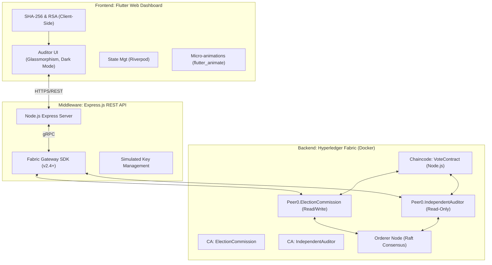

# Blockchain Voting System — Premium Implementation Plan

## Overview

Build a **state-of-the-art, fully functional blockchain voting simulation**. This project goes beyond a simple web app; it is a full-stack decentralized application (dApp) demonstrating enterprise-grade blockchain concepts. 

The system will showcase:
1. **Decentralized Trust:** A multi-organization Hyperledger Fabric network (Election Commission & Independent Auditor).
2. **Cryptographic Anonymity & Security:** Client-side SHA-256 voter hashing and RSA asymmetric encryption of ballots.
3. **Immutable Auditability:** Real-time block minting and transparent ledger verification.
4. **Offensive Security (Red Teaming):** Built-in attack simulations (Sybil, Replay, Tampering, MITM) demonstrating the network's resilience.

---

## Environment Assessment & Strategy

| Tool | Status | Strategy |
|------|--------|----------|
| **Docker Desktop** | ✅ Running (WSL2) | Foundation for the Fabric network. |
| **Node.js / npm** | ✅ v25.6.0 / v11.8.0 | Used for Express API and Chaincode development. |
| **Flutter** | ✅ v3.41.4 (stable) | Target: **Flutter Web**. Mobile toolchain issues bypassed for now to focus on immediate delivery of a beautiful web dashboard. |
| **OS / Shell** | Windows PowerShell | **Critical Constraint:** No native Linux shell. |

> [!IMPORTANT]
> **Windows/PowerShell Constraint Resolution:** 
> Hyperledger Fabric's official setup scripts (`network.sh`) require a full Linux bash environment, which is missing. 
> **Our Elegant Solution:** Instead of brittle manual setups, we will use **Containerized CLI Tools**. We will spin up a `hyperledger/fabric-tools` Docker container, mount our local directory, and execute the necessary `cryptogen`, `configtxgen`, and `peer` commands entirely within the container. This guarantees 100% compatibility on your Windows machine without installing WSL Linux distros.

---

## User Review Required

> [!WARNING]
> **Simulation Scope - Key Management:** In a real election, voters hold their own private keys, or the Election Commission manages a secure KMS. For this *simulation*, the Express API will generate an RSA Keypair on startup. The Public Key will be sent to the Flutter app to encrypt votes. To demonstrate the "Tally" phase, the API will hold the Private Key to decrypt the final results. Is this simulation boundary acceptable?

> [!TIP]
> **Flutter Web Focus:** We are prioritizing a spectacular Flutter Web experience (Chrome). The codebase will be responsive and mobile-ready, but we will not be running Android emulators due to current local toolchain constraints. 

---

## Architecture Design

---

## Phase 1: Hyperledger Fabric Network (The Foundation)

We will orchestrate a deterministic, multi-org network using Docker Compose.

### Core Components
1. **Network Configuration (`crypto-config.yaml`, `configtx.yaml`):** Defines Org1 (ElectionCommission) and Org2 (IndependentAuditor).
2. **Containerized Provisioning:** A custom PowerShell script (`setup.ps1`) that uses `docker run hyperledger/fabric-tools` to generate crypto material and channel artifacts, bypassing Windows pathing issues.
3. **Docker Compose (`docker-compose.yaml`):** Spins up 2 CAs, 2 Peers (with CouchDB state databases), and 1 Raft Orderer.
4. **Node.js Chaincode (`VoteContract`):**
   - Written in JavaScript using `fabric-contract-api`.
   - **Endorsement Policy:** Requires signatures from both Org1 AND Org2 to validate a transaction.
   - **Methods:** `RegisterVoter`, `CastVote`, `QueryVote`, `GetElectionTally`.

---

## Phase 2: Express.js Middleware (The Bridge)

A robust REST API utilizing the modern Hyperledger Fabric Gateway SDK.

### Endpoints
- `POST /api/election/setup`: Generates RSA keypair, initializes ledger.
- `GET /api/election/public-key`: Distributes the public key to the frontend.
- `POST /api/voter/register`: Authorized endpoint (simulating Election Commission CA) to whitelist a `VoterHash`.
- `POST /api/vote/cast`: Submits the `VoterHash` and `EncryptedChoice` to the ledger.
- `GET /api/ledger/blocks`: Fetches raw block data for the visualizer.
- `POST /api/attack/...`: Dedicated endpoints triggering specific failure states to demonstrate network resilience.

---

## Phase 3: Flutter Web UI/UX (The Premium Dashboard)

The UI must be visually stunning, prioritizing a "Cyber-Security / Auditor" aesthetic.

### Technical Stack
- **Framework:** Flutter Web
- **State Management:** `flutter_riverpod` for scalable, reactive state.
- **Animations:** `flutter_animate` for seamless micro-interactions (fade-ins, slides, shimmers).
- **Design System:** Deep dark mode (Navy/Obsidian), Glassmorphism (blur backdrops), Neon accents (Cyan for success, Red for attacks).

### Key Screens & Flows
1. **The Registration Portal:**
   - User inputs a name. 
   - **Animation:** Real-time visual hashing character-by-character into a SHA-256 string.
2. **The Voting Booth:**
   - Candidate selection.
   - **Animation:** The plaintext choice is visibly scrambled into an RSA ciphertext block before network transmission.
3. **The Live Auditor Dashboard (Home):**
   - Real-time statistics (Votes Cast, Blocks Minted).
   - A live, animated visualizer showing blocks being appended to the chain.
4. **The Red Team Control Room (Crucial Step):**
   - An interactive panel to launch attacks against the network.

---

## Phase 4: Red Team Attack Simulations (The Flex)

How the Flutter UI will visually demonstrate the system defending itself:

1. **Sybil Attack (Voter Fraud):**
   - *UI Action:* User clicks "Flood Fake Votes". App generates 100 random hashes and rapid-fires them.
   - *System Defense:* API/Chaincode rejects them. 
   - *Visual:* UI shows a barrage of red "Rejected: Unauthorized Hash" notifications.
2. **Replay Attack (Double Voting):**
   - *UI Action:* User selects a previously cast (valid) vote payload and clicks "Replay".
   - *System Defense:* Chaincode checks CouchDB state `hasVoted: true`.
   - *Visual:* UI shows transaction failing at the peer endorsement phase.
3. **Node Compromise (Tampering):**
   - *UI Action:* User clicks "Alter Ledger State". The API attempts to secretly change a vote in Org1's database.
   - *System Defense:* State hash mismatch between Org1 and Org2.
   - *Visual:* UI shows network halting the next transaction due to Endorsement Policy failure (Mismatching read/write sets).
4. **Man-in-the-Middle (MITM):**
   - *UI Action:* User clicks "Intercept Traffic". 
   - *System Defense:* Client-side encryption.
   - *Visual:* UI displays a mock terminal showing the intercepted packet: it only contains the `VoterHash` and `EncryptedChoice` (useless ciphertext), proving data safety in transit.

---

## Execution Roadmap

- **Step 1:** Author the Fabric network configuration and containerized setup script.
- **Step 2:** Write and test the Node.js Smart Contract logic.
- **Step 3:** Develop the Express.js API and Gateway integration.
- **Step 4:** Build the Flutter UI foundation (Theme, Navigation, Riverpod).
- **Step 5:** Implement the UI Views (Registration, Voting, Auditor Dashboard).
- **Step 6:** Implement and test the Red Team simulation workflows.
- **Step 7:** Final UI Polish and Animation pass.

## Verification
- Successful execution of `setup.ps1` resulting in running Docker containers.
- API endpoints successfully interacting with the Chaincode.
- Flutter UI rendering smoothly in Chrome with zero errors.
- All 4 attack simulations visibly failing as designed, demonstrating system security.
